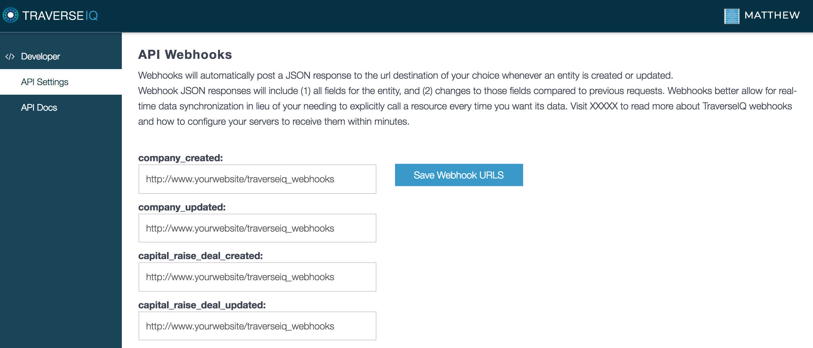

# Introduction

Welcome to the TraverseIQ API! You can use our API to access TraverseIQ API endpoints, which can get information on private companies, investor preference and firm data, capital markets deals, and related professionals in our database.

Our RESTful API is easy to use across Shell, Ruby, PHP, Javascript and Python. You can view code examples in the dark area to the right, and you can switch the programming language of the examples with the tabs in the top right.

# Authentication

> To authorize, use this code:

```ruby
require 'open-uri'

url = "https://traverseiq.com/api/v1/<ENDPOINT>?api_key=your_api_key"

data = open(url).read
```

```python

#python code pending


```

```php

$ch = curl_init("https://traverseiq.com/api/v1/<ENDPOINT>?api_key=your_api_key");
curl_setopt($ch, CURLOPT_RETURNTRANSFER, true);
curl_setopt($ch, CURLOPT_HEADER, 0);
$data = curl_exec($ch);
curl_close($ch);

```

```javascript
//javascript code pending
```

> Make sure to replace `your_api_key` with your API key and `<ENDPOINT>` with the desired resource/endpoint.

TraverseIQ uses API keys to allow access to the API. You can access your TraverseIQ API key at our [developer portal](https://traverseiq.com/developer).

<aside class="notice">
Contact: team@traverseiq.com with any questions regarding access.
</aside>

TraverseIQ expects for the API key to be included in all API requests to the server in a URI string parameter appended to the end of the URI that looks like the following:

`?api_key=your_api_key`

For example, a valid request to the company deals endpoint would look like:

`https://traverseiq.com/api/v1/company-deals?api_key=your_api_key`

<aside class="notice">
You must replace <code>your_api_key</code> with your personal API key.
</aside>

# Company Deals

## Get a Specific Company Deal

```ruby
require 'open-uri'

url = "https://traverseiq.com/api/v1/company-deals/173858?api_key=your_api_key"

data = open(url).read
```

```python
#python code pending
```

```php

$ch = curl_init("https://traverseiq.com/api/v1/company-deals/173858?api_key=your_api_key");
curl_setopt($ch, CURLOPT_RETURNTRANSFER, true);
curl_setopt($ch, CURLOPT_HEADER, 0);
$data = curl_exec($ch);
curl_close($ch);

```

```javascript
//javascript code pending
```

> The above command returns JSON structured like this:

```json
{ 
  "meta": {
    "self": "https://traverseiq.com/api/v1/company-deals/184803",
    "next": "https://traverseiq.com/api/v1/company-deals/184804",
    "prev": "https://traverseiq.com/api/v1/company-deals/184802"
  },
  "data": {
    "entity_type": "Company Deal",
    "traverse_uid": 184803,
    "text_url": "https://techcrunch.com/2018/01/22/uber-rival-cabify-has-raised-another-160m-at-a-1-4b-valuation/",
    "last_updated_at": "2018-01-23",
    "last_updated_at_unix": 1516747617,
    "generated_at_unix": 1516751509,
    "target_company": "Cabify",
    "deal_title": "Series E",
    "deal_stage": "Series C & Later Startups",
    "deal_amount": 160.0,
    "deal_amount_unknown": false,
    "deal_amount_currency_code": "USD",
    "deal_status": "Completed",
    "deal_date": "2018-01-23",
    "deal_date_unknown": false,
    "deal_amount_cash": null,
    "deal_amount_stock": null,
    "deal_amount_primary": null,
    "deal_amount_secondary": null,
    "deal_valuation": 1400.0,
    "deal_valuation_type": "Post-money",
    "deal_valuation_units": "Millions",
    "deal_valuation_currency_code": "USD",
    "buying_investors": [
      {
        "name": "Rakuten Ventures",
        "is_deal_lead": "false",
        "amount_invested": null,
        "investor_type": "Investment Firm",
        "is_sponsor": false,
        "is_creditor": false
      },
      {
        "name": "The Venture City",
        "is_deal_lead": "false",
        "amount_invested": null,
        "investor_type": "Investment Firm",
        "is_sponsor": false,
        "is_creditor": false
      },
      {
        "name": "Endeavor Catalyst",
        "is_deal_lead": "false",
        "amount_invested": null,
        "investor_type": "Investment Firm",
        "is_sponsor": false,
        "is_creditor": false
      },
      {
        "name": "GAT Investments",
        "is_deal_lead": "false",
        "amount_invested": null,
        "investor_type": "Investment Firm",
        "is_sponsor": false,
        "is_creditor": false
      },
      {
        "name": "Liil Ventures",
        "is_deal_lead": "false",
        "amount_invested": null,
        "investor_type": "Investment Firm",
        "is_sponsor": false,
        "is_creditor": false
      },
      {
        "name": "Western Technology Investment (WTI)",
        "is_deal_lead": "false",
        "amount_invested": null,
        "investor_type": "Investment Firm",
        "is_sponsor": false,
        "is_creditor": false
      }
    ],
    "selling_investors": [

    ],
    "deal_advisors": [

    ],
    "target_company_website": "https://cabify.com",
    "target_company_hq_city": "Madrid",
    "target_company_hq_state": "Madrid",
    "target_company_hq_country": "Spain",
    "target_company_year_founded": "2011",
    "target_company_description": "Cabify is a Madrid-based on demand cab and travel startup that competes with the likes of Uber. Cabify allows both individuals and corporate accounts to order a car via a smartphone and and a private driver will pick them up within minutes.",
    "target_company_tags": [
      "sharing economy / collaborative consumption",
      "car sharing",
      "mobile app",
      "travel",
      "corporate & executive travel",
      "transportation apps",
      "travel technology",
      "consumer services",
      "travel services",
      "freight, logistics & transportation",
      "location-based services",
      "technology",
      "real-time location services (rtls)",
      "taxis & paid car transportation"
    ],
    "custom_client_industries": {
      "industry_ids": [
        1000001,
        1200062,
        105346003,
        10645004,
        104005,
        10006,
        1096507,
        13467408,
        159990
      ],
      "industry_names": [
        "Crowdsourcing",
        "Car Sharing",
        "Mobile Applications",
        "Travel & Leisure Services",
        "Transportation",
        "Other Travel & Leisure",
        "Booking Technology",
        "Other Services",
        "Supply Chain",
        "Location Based Services",
        "Technology",
        "Tracking Technology",
        "Taxis & Cabs"
      ]
    },
    "target_company_stats": [
      {
        "stat_name": "Users (Total)",
        "stat_value_type": "Number/Count",
        "stat_value_range_start": 13000000.0,
        "stat_value_range_end": 13000000.0,
        "stat_year": "2017",
        "stat_as_of_date": "2018-01-23"
      },
      {
        "stat_name": "Employees",
        "stat_value_type": "Number/Count",
        "stat_value_range_start": 51.0,
        "stat_value_range_end": 51.0,
        "stat_year": "2016",
        "stat_as_of_date": "2016-08-01"
      }
    ],
    "target_company_people": [
      {
        "name": "Vicente Pascual",
        "job_title": "Chief Executive Officer (CEO)"
      },
      {
        "name": "Cameron Winklevoss",
        "job_title": "Deal Team - Capital Raise or M&A"
      },
      {
        "name": "Salim Mitha",
        "job_title": "Deal Team - Capital Raise or M&A"
      },
      {
        "name": "Juan De Antonio",
        "job_title": "Founder"
      },
      {
        "name": "Christopher Novak",
        "job_title": "Deal Team - Capital Raise or M&A"
      },
      {
        "name": "Laurent Drion",
        "job_title": "Advisor"
      },
      {
        "name": "Inaki Berenguer",
        "job_title": "Deal Team - Capital Raise or M&A"
      },
      {
        "name": "Simon Squibb",
        "job_title": "Deal Team - Capital Raise or M&A"
      },
      {
        "name": "Patrice Decafmeyer",
        "job_title": "Advisor"
      },
      {
        "name": "Sam Lown",
        "job_title": "Founder"
      },
      {
        "name": "Tyler Winklevoss",
        "job_title": "Deal Team - Capital Raise or M&A"
      }
    ],
    "additional_entity_info": [
      {
        "name": "Western Technology Investment (WTI)",
        "description": "Western Technology Investment (WTI) has provided over $3 billion of debt and equity capital to technology and life science companies ranging from early-stage private companies to publicly-traded companies.  Their investments range from $250k to $30M and are structured as fully usable, unrestricted growth capital. WTI has an exceptionally stable capital base which allows them to be highly responsive, risk tolerant and creative in addressing each company's unique capital requirements. WTI's consistently strong alignment with a company's management team and equity investors.",
        "website": "www.westerntech.com",
        "hq_city": "Portola Valley",
        "hq_state": "California",
        "hq_country": "United States"
      }
    ],
    "as_of_dates": [
      {
        "field": "deal_title",
        "as_of_date": "2018-01-23"
      },
      {
        "field": "deal_stage",
        "as_of_date": "2018-01-23"
      },
      {
        "field": "deal_amount",
        "as_of_date": "2018-01-23"
      },
      {
        "field": "deal_amount_unknown",
        "as_of_date": "2018-01-23"
      },
      {
        "field": "deal_amount_currency_code",
        "as_of_date": "2018-01-23"
      },
      {
        "field": "deal_status",
        "as_of_date": "2018-01-23"
      },
      {
        "field": "deal_date",
        "as_of_date": "2018-01-23"
      },
      {
        "field": "deal_valuation",
        "as_of_date": "2018-01-23"
      },
      {
        "field": "deal_valuation_type",
        "as_of_date": "2018-01-23"
      },
      {
        "field": "buying_investors",
        "as_of_date": "2018-01-23"
      },
      {
        "field": "selling_investors",
        "as_of_date": null
      },
      {
        "field": "target_company_description",
        "as_of_date": "2018-01-23"
      }
    ],
    "signature": "ddf77ea9b5ba3e6840442898927fe4e3c9aeb13c55058ceffa93aa546abbecf2",
    "entity_changes": {
      "current_request": {
        "generated_at": 1516751511
      },
      "previous_request": {
        "generated_at": 1516751508
      },
      "diff": {
        "additions": [

        ],
        "removals": [

        ],
        "modifications": [
          {
            "field": "generated_at_unix",
            "old_value": 1516751506,
            "new_value": 1516751509
          }
        ]
      }
    }
  }
}
```

This endpoint retrieves a specific company deal.


### HTTP Request

`GET https://traverseiq.com/api/v1/company-deals/<ID>`

### URL Parameters

Parameter | Description
--------- | -----------
ID | The ID of the company deal to retrieve


### Fields Returned

Field | Type | Description
--------- | ------- | -----------
meta | Object | Links to current, next and previous entities
data | Object | Container object for all entity data
entity_type | String | Type of entity returned
traverse_uid | Integer | Unique identifier for entity's resource
text_url | String | URL for article pertaining to deal
last_updated_at | String | Date entity last updated (string format)
last_updated_at_unix | Integer | Date entity last updated (unix format)
generated_at_unix | Integer | Timestamp for when entity info generated for api request (unix format)
target_company | String | Company name for given deal
deal_title | String | Deal title for given deal
deal_stage | String | Deal stage for given deal
deal_amount | Decimal | Deal amount for given deal
deal_amount_unknown | Boolean | True if deal amount unknown
deal_amount_currency_code | String | Currency for above deal amount
deal_status | String | Status of given deal
deal_date | String | Announced date
deal_date_unknown | Boolean | True if deal date unknown
deal_amount_cash | Decimal | Deal amount known to be in cash
deal_amount_stock | Decimal | Deal amount known to be in stock/equity
deal_amount_primary | Decimal | Deal amount known to be primary investment
deal_amount_secondary | Decimal | Deal amount known to be secondary investment
deal_valuation | Decimal | Valuation of company for deal
deal_valuation_type | String | Valuation type: Post-money, Pre-money or Unknown
deal_valuation_units | String | Valuation units (default = millions)
deal_valuation_currency_code | String | Currency for above deal valuation
buying_investors | Array | Array of investor objects for buying investors in deal
selling_investors | Array | Array of investor objects for selling investors in deal
deal_advisors | Array | Array of deal advisors
target_company_website | String | Website of target company
target_company_hq_city | String | City of target company
target_company_hq_state | String | State of target company
target_company_hq_country | String | Country of target company
target_company_year_founded | String | Year Founded of target company
target_company_description | String | Description of target company
target_company_tags | Array | Industry Tags of target company
custom_client_industries | Object | Unique confidential industry tags/codes customizable for each API account
target_company_stats | Array | Stats of target company (e.g. employees, revenue, growth %)
target_company_people | Array | Employees/Related professionals of target company
additional_entity_info | Array | Additional information for associated entity objects above
as_of_dates | Array | As of dates for fields above
signature | String | SHA256 digest of API account's secret key for client-side validation
entity_changes | Object | Changes in entity / JSON since last request


## Get All Company Deals

```ruby
require 'open-uri'

url = "https://traverseiq.com/api/v1/company-deals?api_key=your_api_key"

data = open(url).read
```

```python
#python code pending
```

```php

$ch = curl_init("https://traverseiq.com/api/v1/company-deals?api_key=your_api_key");
curl_setopt($ch, CURLOPT_RETURNTRANSFER, true);
curl_setopt($ch, CURLOPT_HEADER, 0);
$data = curl_exec($ch);
curl_close($ch);

```

```javascript
//javascript code pending
```

> Make sure to replace `your_api_key` with your API key.


This endpoint retrieves all company deals.

### HTTP Request

`GET https://traverseiq.com/api/v1/company-deals`

### Query Parameters

Parameter | Default | Description
--------- | ------- | -----------
ids | [] | If set to array of IDs, will return specific company deals requested
last_updated_at | "" | String date in "YYYY-MM-DD" format will return company deals updated on given date
limit | 20 | Limit of company deals returned for each request

<aside class="success">
Remember — each request must contain your personal API key.
</aside>


# Companies

## Get a Specific Company

```ruby
require 'open-uri'

url = "https://traverseiq.com/api/v1/companies/59924?api_key=your_api_key"

data = open(url).read
```

```python
#python code pending
```

```php

$ch = curl_init("https://traverseiq.com/api/v1/companies/59924?api_key=your_api_key");
curl_setopt($ch, CURLOPT_RETURNTRANSFER, true);
curl_setopt($ch, CURLOPT_HEADER, 0);
$data = curl_exec($ch);
curl_close($ch);

```

```javascript
//javascript code pending
```

> The above command returns JSON structured like this:

```json
{
  "meta": {
    "self": "https://traverseiq.com/api/v1/companies/55572",
    "next": "https://traverseiq.com/api/v1/companies/55573",
    "prev": "https://traverseiq.com/api/v1/companies/55571"
  },
  "data": {
    "entity_type": "Company",
    "traverse_uid": 55572,
    "last_updated_at": "2018-01-23",
    "last_updated_at_unix": 1516747555,
    "generated_at_unix": 1516751945,
    "name": "Rainforest QA",
    "capital_raised_total_recorded": 41200000,
    "stage_preference": "Series A & B Startups",
    "website": "www.rainforestqa.com",
    "hq_city": "San Francisco",
    "hq_state": "California",
    "hq_country": "United States",
    "year_founded": "2012",
    "description": "Rainforest is changing the way QA is done in an era of continuous delivery. Our on-demand QA solution improves the customer experience by enabling development teams to discover significantly more problems before code hits production. Hundreds of companies including Adobe, Oracle, and Solarwinds use Rainforest to automate their QA testing process and easily integrate it with their development workflow via a simple API. ",
    "tags": [
      "business (b2b) services",
      "technology infrastructure & architecture",
      "b2b software",
      "software deployment & delivery",
      "software & web engineering and development services",
      "software testing & debugging",
      "web developer & programming tools",
      "enterprise software",
      "Software as a Service (SaaS)",
      "big data",
      "machine learning",
      "technology"
    ],
    "custom_client_industries": {
      "industry_ids": [
        5387875,
        55875525,
        558787,
        55875545,
        558755,
        55875535,
        98787324,
        558755875,
        53875552,
        55875599,
        5501547
      ],
      "industry_names": [
        "Business Services",
        "Tech Infrastructure",
        "Technology",
        "Software-as-a-Service (SaaS)",
        "Software",
        "Website Design & Hosting",
        "Application Software",
        "Other Software",
        "Data Analysis"
      ]
    },
    "people": [
      {
        "name": "Fred Stevens Smith",
        "job_title": "Chief Executive Officer (CEO)",
        "current_position": true,
        "as_of_date": "2018-01-23",
        "record_url": "https://traverseiq.com/api/v1/people/56557"
      },
      {
        "name": "Byron Deeter",
        "job_title": "Deal Team - Capital Raise or M&A",
        "current_position": true,
        "as_of_date": "2018-01-23",
        "record_url": "https://traverseiq.com/api/v1/people/48116"
      },
      {
        "name": "Danielle Morrill",
        "job_title": "Advisor",
        "current_position": true,
        "as_of_date": "2016-08-01",
        "record_url": "https://traverseiq.com/api/v1/people/33205"
      },
      {
        "name": "Geoff Watts",
        "job_title": "Advisor",
        "current_position": true,
        "as_of_date": "2016-08-01",
        "record_url": "https://traverseiq.com/api/v1/people/30983"
      }
    ],
    "capital_markets_activity": [
      {
        "record_url": "https://traverseiq.com/api/v1/company-deals/184788",
        "deal_date": "2018-01-23",
        "deal_title": "Series B",
        "deal_stage": "Series A & B Startups",
        "deal_amount": 25.0,
        "deal_amount_unknown": false,
        "deal_amount_currency_code": "USD",
        "deal_status": "Completed"
      },
      {
        "record_url": "https://traverseiq.com/api/v1/company-deals/172192",
        "deal_date": "2016-02-17",
        "deal_title": "Series A",
        "deal_stage": "Series A & B Startups",
        "deal_amount": 12.0,
        "deal_amount_unknown": false,
        "deal_amount_currency_code": "USD",
        "deal_status": "Completed"
      }
    ],
    "stats": [
      {
        "stat_name": "Revenue Growth (3 Years)",
        "stat_value_type": "Percent",
        "stat_value_range_start": 3000.0,
        "stat_value_range_end": 3000.0,
        "stat_year": 2017,
        "stat_as_of_date": "2018-01-23"
      },
      {
        "stat_name": "Capital Raised To Date",
        "stat_value_type": "Currency",
        "stat_value_range_start": 41200000.0,
        "stat_value_range_end": 41200000.0,
        "stat_value_currency_code": "USD",
        "stat_year": null,
        "stat_as_of_date": "2018-01-23"
      },
      {
        "stat_name": "Employees",
        "stat_value_type": "Number/Count",
        "stat_value_range_start": 51.0,
        "stat_value_range_end": 200.0,
        "stat_as_of_date": "2018-01-23"
      }
    ],
    "as_of_dates": [
      {
        "field": "name",
        "as_of_date": "2018-01-23"
      },
      {
        "field": "website",
        "as_of_date": "2018-01-23"
      },
      {
        "field": "year_founded",
        "as_of_date": "2018-01-23"
      },
      {
        "field": "capital_raised_total_recorded",
        "as_of_date": "2018-01-23"
      },
      {
        "field": "stage_preference",
        "as_of_date": "2018-01-23"
      },
      {
        "field": "hq_city",
        "as_of_date": "2018-01-23"
      },
      {
        "field": "hq_state",
        "as_of_date": "2018-01-23"
      },
      {
        "field": "hq_country",
        "as_of_date": "2018-01-23"
      },
      {
        "field": "description",
        "as_of_date": "2018-01-23"
      },
      {
        "field": "tags",
        "as_of_date": "2018-01-23"
      },
      {
        "field": "stats",
        "as_of_date": "2018-01-23"
      }
    ],
    "signature": "ddf77ea9b5ba3e6840442898927fe4e3c9aeb13c55058ceffa93aa546abbecf2",
    "entity_changes": {
      "current_request": {
        "generated_at": 1516751946
      },
      "previous_request": {
        "generated_at": 1516751935
      },
      "diff": {
        "additions": [

        ],
        "removals": [

        ],
        "modifications": [
          {
            "field": "generated_at_unix",
            "old_value": 1516751935,
            "new_value": 1516751945
          }
        ]
      }
    }
  }
}
```

This endpoint retrieves a specific company.


### HTTP Request

`GET https://traverseiq.com/api/v1/companies/<ID>`

### URL Parameters

Parameter | Description
--------- | -----------
ID | The ID of the company to retrieve


## Get All Companies

```ruby
require 'open-uri'

url = "https://traverseiq.com/api/v1/companies?api_key=your_api_key"

data = open(url).read
```

```python
#python code pending
```

```php

$ch = curl_init("https://traverseiq.com/api/v1/companies?api_key=your_api_key");
curl_setopt($ch, CURLOPT_RETURNTRANSFER, true);
curl_setopt($ch, CURLOPT_HEADER, 0);
$data = curl_exec($ch);
curl_close($ch);

```

```javascript
//javascript code pending
```

> Make sure to replace `your_api_key` with your API key.


This endpoint retrieves all companies.

### HTTP Request

`GET https://traverseiq.com/api/v1/companies`

### Query Parameters

Parameter | Default | Description
--------- | ------- | -----------
ids | [] | If set to array of IDs, will return specific companies requested
limit | 20 | Limit of companies returned for each request


# Investors

## Get a Specific Investor

```ruby
require 'open-uri'

url = "https://traverseiq.com/api/v1/investors/2023?api_key=your_api_key"

data = open(url).read
```

```python
#python code pending
```

```php

$ch = curl_init("https://traverseiq.com/api/v1/investors/2023?api_key=your_api_key");
curl_setopt($ch, CURLOPT_RETURNTRANSFER, true);
curl_setopt($ch, CURLOPT_HEADER, 0);
$data = curl_exec($ch);
curl_close($ch);

```

```javascript
//javascript code pending
```

> The above command returns JSON structured like this:

```json
{
  "meta": {
    "self": "https://traverseiq.com/api/v1/investors/2023",
    "next": "https://traverseiq.com/api/v1/investors/2024",
    "prev": "https://traverseiq.com/api/v1/investors/2022"
  },
  "data": {
    "entity_type": "Investor",
    "traverse_uid": 2023,
    "last_updated_at": "2017-08-27",
    "last_updated_at_unix": 1503875124,
    "generated_at_unix": 1516750989,
    "name": "ShoreView Industries",
    "website": "www.shoreview.com",
    "hq_city": "Minneapolis",
    "hq_state": "Minnesota",
    "hq_country": "United States",
    "year_founded": "2002",
    "description": "Minneapolis-based ShoreView Industries manages $900 million in private equity funds. ShoreView invests in established companies with operations in North America, across a wide range of industries. ShoreView structures a variety of acquisition, recapitalization and build-up transactions, typically in businesses with revenues ranging between $20 million and $300 million. The Partners at ShoreView have completed over 90 investments together since 1995. They have a long history of partnering with entrepreneurial and family-owned businesses.  Their team has a broad and complementary array of transactional, legal, financial and operating experience, which contributes to an efficient and effective decision making and investment process.",
    "investment_mandates": [
      {
        "name": "General Investment Strategy",
        "status": "Active",
        "deal_types": [
          "Majority Equity Investments"
        ],
        "stage_preferences": [
          "Non-Startup Growth Companies",
          "Established Middle Market"
        ],
        "industry_preferences": [
          "industrials",
          "materials & natural resources",
          "distribution",
          "business (b2b) services"
        ],
        "custom_client_industry_preferences": {
          "industry_ids": [
            1603450,
            235000,
            4900201
          ],
          "industry_names": [
            "Transportation",
            "Industrials",
            "Business Services"
          ]
        },
        "deal_size_min": 5000000,
        "deal_size_max": 35000000,
        "target_revenue_min": 7500000,
        "target_revenue_max": 200000000,
        "target_ebitda_min": 2000000,
        "target_ebitda_max": 35000000,
        "as_of_date": "2017-04-21"
      }
    ],
    "recorded_investments": {
      "investments": [
        {
          "record_url": "https://traverseiq.com/api/v1/company-deals/1654",
          "target_company": "Rohrer Corporation",
          "target_company_url": "https://traverseiq.com/api/v1/companies/13660",
          "deal_date": "2010-12-26",
          "deal_title": "Merger & Acquisition / Buyout",
          "deal_stage": "Established Middle Market",
          "deal_amount": null,
          "deal_amount_unknown": true,
          "deal_amount_currency_code": null,
          "is_deal_lead": "false",
          "amount_invested": null,
          "investor_type": "Investment Firm",
          "is_sponsor": false,
          "is_creditor": false,
          "deal_status": "Completed",
          "as_of_date": "2015-08-07"
        },
        {
          "record_url": "https://traverseiq.com/api/v1/company-deals/6661",
          "target_company": "Fabreeka International",
          "target_company_url": "https://traverseiq.com/api/v1/companies/48960",
          "deal_date": "2011-04-01",
          "deal_title": "Merger & Acquisition / Buyout",
          "deal_stage": "Established Middle Market",
          "deal_amount": 30.0,
          "deal_amount_unknown": false,
          "deal_amount_currency_code": null,
          "is_deal_lead": "true",
          "amount_invested": null,
          "investor_type": "Investment Firm",
          "is_sponsor": false,
          "is_creditor": false,
          "deal_status": "Completed",
          "as_of_date": "2016-01-21"
        },
        {
          "record_url": "https://traverseiq.com/api/v1/company-deals/143508",
          "target_company": "SWS Environmental Services",
          "target_company_url": "https://traverseiq.com/api/v1/companies/34608",
          "deal_date": null,
          "deal_title": "Merger & Acquisition / Buyout",
          "deal_stage": "Established Middle Market",
          "deal_amount": null,
          "deal_amount_unknown": true,
          "deal_amount_currency_code": null,
          "is_deal_lead": "true",
          "amount_invested": null,
          "investor_type": "Investment Firm",
          "is_sponsor": false,
          "is_creditor": false,
          "deal_status": "Completed",
          "as_of_date": "2016-01-27"
        },
        {
          "record_url": "https://traverseiq.com/api/v1/company-deals/143644",
          "target_company": "Tex Tech Industries",
          "target_company_url": "https://traverseiq.com/api/v1/companies/35453",
          "deal_date": null,
          "deal_title": "Merger & Acquisition / Buyout",
          "deal_stage": "Established Middle Market",
          "deal_amount": null,
          "deal_amount_unknown": true,
          "deal_amount_currency_code": null,
          "is_deal_lead": "true",
          "amount_invested": null,
          "investor_type": "Investment Firm",
          "is_sponsor": false,
          "is_creditor": false,
          "deal_status": "Completed",
          "as_of_date": "2016-01-27"
        },
        {
          "record_url": "https://traverseiq.com/api/v1/company-deals/173163",
          "target_company": "Edstrom, Inc.",
          "target_company_url": "https://traverseiq.com/api/v1/companies/56413",
          "deal_date": "2016-02-01",
          "deal_title": "Merger & Acquisition / Buyout",
          "deal_stage": "Established Middle Market",
          "deal_amount": null,
          "deal_amount_unknown": true,
          "deal_amount_currency_code": null,
          "is_deal_lead": "true",
          "amount_invested": null,
          "investor_type": "Investment Firm",
          "is_sponsor": false,
          "is_creditor": false,
          "deal_status": "Completed",
          "as_of_date": "2016-03-22"
        },
        {
          "record_url": "https://traverseiq.com/api/v1/company-deals/138729",
          "target_company": "World Wide Packaging LLC",
          "target_company_url": "https://traverseiq.com/api/v1/companies/13661",
          "deal_date": null,
          "deal_title": "Merger & Acquisition / Buyout",
          "deal_stage": "Established Middle Market",
          "deal_amount": null,
          "deal_amount_unknown": true,
          "deal_amount_currency_code": null,
          "is_deal_lead": "true",
          "amount_invested": null,
          "investor_type": "Investment Firm",
          "is_sponsor": false,
          "is_creditor": false,
          "deal_status": "Completed",
          "as_of_date": "2016-01-27"
        },
        {
          "record_url": "https://traverseiq.com/api/v1/company-deals/138780",
          "target_company": "Niagara Thermal Products",
          "target_company_url": "https://traverseiq.com/api/v1/companies/13736",
          "deal_date": null,
          "deal_title": "Merger & Acquisition / Buyout",
          "deal_stage": "Established Middle Market",
          "deal_amount": null,
          "deal_amount_unknown": true,
          "deal_amount_currency_code": null,
          "is_deal_lead": "true",
          "amount_invested": null,
          "investor_type": "Investment Firm",
          "is_sponsor": false,
          "is_creditor": false,
          "deal_status": "Completed",
          "as_of_date": "2016-01-27"
        },
        {
          "record_url": "https://traverseiq.com/api/v1/company-deals/76182",
          "target_company": "Mori Lee",
          "target_company_url": "https://traverseiq.com/api/v1/companies/13731",
          "deal_date": "2014-07-29",
          "deal_title": "Merger & Acquisition / Buyout",
          "deal_stage": "Established Middle Market",
          "deal_amount": null,
          "deal_amount_unknown": true,
          "deal_amount_currency_code": null,
          "is_deal_lead": "true",
          "amount_invested": null,
          "investor_type": "Investment Firm",
          "is_sponsor": false,
          "is_creditor": false,
          "deal_status": "Completed",
          "as_of_date": "2016-02-08"
        },
        {
          "record_url": "https://traverseiq.com/api/v1/company-deals/179618",
          "target_company": "Pacific Aerospace & Electronics",
          "target_company_url": "https://traverseiq.com/api/v1/companies/65717",
          "deal_date": "2015-08-01",
          "deal_title": "Merger & Acquisition / Buyout",
          "deal_stage": "Established Middle Market",
          "deal_amount": null,
          "deal_amount_unknown": true,
          "deal_amount_currency_code": null,
          "is_deal_lead": "true",
          "amount_invested": null,
          "investor_type": "Investment Firm",
          "is_sponsor": false,
          "is_creditor": false,
          "deal_status": "Completed",
          "as_of_date": "2016-11-30"
        },
        {
          "record_url": "https://traverseiq.com/api/v1/company-deals/179619",
          "target_company": "Spring (U.S.A.) Corporation",
          "target_company_url": "https://traverseiq.com/api/v1/companies/65718",
          "deal_date": "2016-10-31",
          "deal_title": "Merger & Acquisition / Buyout",
          "deal_stage": "Established Middle Market",
          "deal_amount": null,
          "deal_amount_unknown": true,
          "deal_amount_currency_code": null,
          "is_deal_lead": "true",
          "amount_invested": null,
          "investor_type": "Investment Firm",
          "is_sponsor": false,
          "is_creditor": false,
          "deal_status": "Completed",
          "as_of_date": "2016-11-30"
        },
        {
          "record_url": "https://traverseiq.com/api/v1/company-deals/151135",
          "target_company": "RollEase",
          "target_company_url": "https://traverseiq.com/api/v1/companies/3465",
          "deal_date": "2013-08-08",
          "deal_title": "Recapitalization / Other",
          "deal_stage": "Established Middle Market",
          "deal_amount": null,
          "deal_amount_unknown": true,
          "deal_amount_currency_code": null,
          "is_deal_lead": "true",
          "amount_invested": null,
          "investor_type": "Investment Firm",
          "is_sponsor": false,
          "is_creditor": false,
          "deal_status": "Completed",
          "as_of_date": "2016-11-30"
        },
        {
          "record_url": "https://traverseiq.com/api/v1/company-deals/154626",
          "target_company": "Twinco Romax",
          "target_company_url": "https://traverseiq.com/api/v1/companies/36894",
          "deal_date": "2010-01-04",
          "deal_title": "Merger & Acquisition / Buyout",
          "deal_stage": "Established Middle Market",
          "deal_amount": null,
          "deal_amount_unknown": true,
          "deal_amount_currency_code": null,
          "is_deal_lead": "true",
          "amount_invested": null,
          "investor_type": "Investment Firm",
          "is_sponsor": false,
          "is_creditor": false,
          "deal_status": "Completed",
          "as_of_date": "2016-11-30"
        },
        {
          "record_url": "https://traverseiq.com/api/v1/company-deals/78958",
          "target_company": "Cass Polymers",
          "target_company_url": "https://traverseiq.com/api/v1/companies/20041",
          "deal_date": "2012-07-17",
          "deal_title": "Merger & Acquisition / Buyout",
          "deal_stage": "Established Middle Market",
          "deal_amount": null,
          "deal_amount_unknown": true,
          "deal_amount_currency_code": null,
          "is_deal_lead": "true",
          "amount_invested": null,
          "investor_type": "Investment Firm",
          "is_sponsor": false,
          "is_creditor": false,
          "deal_status": "Completed",
          "as_of_date": "2016-11-30"
        },
        {
          "record_url": "https://traverseiq.com/api/v1/company-deals/179621",
          "target_company": "MI Windows and Doors",
          "target_company_url": "https://traverseiq.com/api/v1/companies/65719",
          "deal_date": "2013-01-01",
          "deal_title": "Merger & Acquisition / Buyout",
          "deal_stage": "Established Middle Market",
          "deal_amount": null,
          "deal_amount_unknown": true,
          "deal_amount_currency_code": null,
          "is_deal_lead": "true",
          "amount_invested": null,
          "investor_type": "Investment Firm",
          "is_sponsor": false,
          "is_creditor": false,
          "deal_status": "Completed",
          "as_of_date": "2016-11-30"
        },
        {
          "record_url": "https://traverseiq.com/api/v1/company-deals/113047",
          "target_company": "G.E.T. Enterprises",
          "target_company_url": "https://traverseiq.com/api/v1/companies/2537",
          "deal_date": "2011-11-01",
          "deal_title": "Merger & Acquisition / Buyout",
          "deal_stage": "Established Middle Market",
          "deal_amount": null,
          "deal_amount_unknown": true,
          "deal_amount_currency_code": null,
          "is_deal_lead": "true",
          "amount_invested": null,
          "investor_type": "Investment Firm",
          "is_sponsor": false,
          "is_creditor": false,
          "deal_status": "Completed",
          "as_of_date": "2016-11-30"
        },
        {
          "record_url": "https://traverseiq.com/api/v1/company-deals/179624",
          "target_company": "Abrasive Products & Equipment",
          "target_company_url": "https://traverseiq.com/api/v1/companies/16051",
          "deal_date": "2010-07-29",
          "deal_title": "Merger & Acquisition / Buyout",
          "deal_stage": "Established Middle Market",
          "deal_amount": null,
          "deal_amount_unknown": true,
          "deal_amount_currency_code": null,
          "is_deal_lead": "true",
          "amount_invested": null,
          "investor_type": "Investment Firm",
          "is_sponsor": false,
          "is_creditor": false,
          "deal_status": "Completed",
          "as_of_date": "2016-11-30"
        },
        {
          "record_url": "https://traverseiq.com/api/v1/company-deals/179626",
          "target_company": "American De-Rosa Lamparts",
          "target_company_url": "https://traverseiq.com/api/v1/companies/1261",
          "deal_date": "2006-05-01",
          "deal_title": "Merger & Acquisition / Buyout",
          "deal_stage": "Established Middle Market",
          "deal_amount": null,
          "deal_amount_unknown": true,
          "deal_amount_currency_code": null,
          "is_deal_lead": "true",
          "amount_invested": null,
          "investor_type": "Investment Firm",
          "is_sponsor": false,
          "is_creditor": false,
          "deal_status": "Completed",
          "as_of_date": "2016-11-30"
        }
      ],
      "exits": [
        {
          "record_url": "https://traverseiq.com/api/v1/company-deals/182339",
          "target_company": "Tex Tech Industries",
          "target_company_url": "https://traverseiq.com/api/v1/companies/35453",
          "deal_date": "2017-08-24",
          "deal_title": "Merger & Acquisition / Buyout",
          "deal_stage": "Established Middle Market",
          "deal_amount": null,
          "deal_amount_unknown": true,
          "deal_amount_currency_code": null,
          "maintained_ownership": "false",
          "amount_received": null,
          "investor_type": "Investment Firm",
          "is_sponsor": false,
          "is_creditor": false,
          "deal_status": "Completed",
          "as_of_date": "2017-08-25"
        },
        {
          "record_url": "https://traverseiq.com/api/v1/company-deals/6662",
          "target_company": "Fabreeka International",
          "target_company_url": "https://traverseiq.com/api/v1/companies/48960",
          "deal_date": "2012-05-29",
          "deal_title": "Merger & Acquisition / Buyout",
          "deal_stage": "Established Middle Market",
          "deal_amount": 54.0,
          "deal_amount_unknown": false,
          "deal_amount_currency_code": null,
          "maintained_ownership": "false",
          "amount_received": null,
          "investor_type": "Investment Firm",
          "is_sponsor": false,
          "is_creditor": false,
          "deal_status": "Completed",
          "as_of_date": "2016-01-21"
        },
        {
          "record_url": "https://traverseiq.com/api/v1/company-deals/173164",
          "target_company": "Niagara Thermal Products",
          "target_company_url": "https://traverseiq.com/api/v1/companies/13736",
          "deal_date": "2016-01-01",
          "deal_title": "Merger & Acquisition / Buyout",
          "deal_stage": "Established Middle Market",
          "deal_amount": null,
          "deal_amount_unknown": true,
          "deal_amount_currency_code": null,
          "maintained_ownership": "false",
          "amount_received": null,
          "investor_type": "Investment Firm",
          "is_sponsor": false,
          "is_creditor": false,
          "deal_status": "Completed",
          "as_of_date": "2016-03-22"
        },
        {
          "record_url": "https://traverseiq.com/api/v1/company-deals/179620",
          "target_company": "Twinco Romax",
          "target_company_url": "https://traverseiq.com/api/v1/companies/36894",
          "deal_date": "2012-08-01",
          "deal_title": "Merger & Acquisition / Buyout",
          "deal_stage": "Established Middle Market",
          "deal_amount": null,
          "deal_amount_unknown": true,
          "deal_amount_currency_code": null,
          "maintained_ownership": "false",
          "amount_received": null,
          "investor_type": "Investment Firm",
          "is_sponsor": false,
          "is_creditor": false,
          "deal_status": "Completed",
          "as_of_date": "2016-11-30"
        },
        {
          "record_url": "https://traverseiq.com/api/v1/company-deals/179622",
          "target_company": "MI Windows and Doors",
          "target_company_url": "https://traverseiq.com/api/v1/companies/65719",
          "deal_date": "2016-08-01",
          "deal_title": "Merger & Acquisition / Buyout",
          "deal_stage": "Established Middle Market",
          "deal_amount": null,
          "deal_amount_unknown": true,
          "deal_amount_currency_code": null,
          "maintained_ownership": "false",
          "amount_received": null,
          "investor_type": "Investment Firm",
          "is_sponsor": false,
          "is_creditor": false,
          "deal_status": "Completed",
          "as_of_date": "2016-11-30"
        },
        {
          "record_url": "https://traverseiq.com/api/v1/company-deals/179623",
          "target_company": "G.E.T. Enterprises",
          "target_company_url": "https://traverseiq.com/api/v1/companies/2537",
          "deal_date": "2016-02-01",
          "deal_title": "Merger & Acquisition / Buyout",
          "deal_stage": "Established Middle Market",
          "deal_amount": null,
          "deal_amount_unknown": true,
          "deal_amount_currency_code": null,
          "maintained_ownership": "false",
          "amount_received": null,
          "investor_type": "Investment Firm",
          "is_sponsor": false,
          "is_creditor": false,
          "deal_status": "Completed",
          "as_of_date": "2016-11-30"
        },
        {
          "record_url": "https://traverseiq.com/api/v1/company-deals/179625",
          "target_company": "Abrasive Products & Equipment",
          "target_company_url": "https://traverseiq.com/api/v1/companies/16051",
          "deal_date": "2014-09-29",
          "deal_title": "Merger & Acquisition / Buyout",
          "deal_stage": "Established Middle Market",
          "deal_amount": null,
          "deal_amount_unknown": true,
          "deal_amount_currency_code": null,
          "maintained_ownership": "false",
          "amount_received": null,
          "investor_type": "Investment Firm",
          "is_sponsor": false,
          "is_creditor": false,
          "deal_status": "Completed",
          "as_of_date": "2016-11-30"
        },
        {
          "record_url": "https://traverseiq.com/api/v1/company-deals/179627",
          "target_company": "American De-Rosa Lamparts",
          "target_company_url": "https://traverseiq.com/api/v1/companies/1261",
          "deal_date": "2016-10-01",
          "deal_title": "Merger & Acquisition / Buyout",
          "deal_stage": "Established Middle Market",
          "deal_amount": null,
          "deal_amount_unknown": true,
          "deal_amount_currency_code": null,
          "maintained_ownership": "false",
          "amount_received": null,
          "investor_type": "Investment Firm",
          "is_sponsor": false,
          "is_creditor": false,
          "deal_status": "Completed",
          "as_of_date": "2016-11-30"
        }
      ]
    },
    "people": [
      {
        "name": "Tom D'Ovidio",
        "job_title": "Partner",
        "current_position": true,
        "as_of_date": "2017-04-15",
        "record_url": "https://traverseiq.com/api/v1/people/35145"
      },
      {
        "name": "Adam Reeves",
        "job_title": "Principal",
        "current_position": true,
        "as_of_date": "2017-04-15",
        "record_url": "https://traverseiq.com/api/v1/people/2802"
      },
      {
        "name": "Scott Gage",
        "job_title": "Partner",
        "current_position": true,
        "as_of_date": "2017-04-24",
        "record_url": "https://traverseiq.com/api/v1/people/18204"
      },
      {
        "name": "Elliot Lynch",
        "job_title": "Senior Associate",
        "current_position": true,
        "as_of_date": "2017-04-24",
        "record_url": "https://traverseiq.com/api/v1/people/2808"
      },
      {
        "name": "Mark Shelson",
        "job_title": "Associate",
        "current_position": true,
        "as_of_date": "2017-11-29",
        "record_url": "https://traverseiq.com/api/v1/people/38315"
      },
      {
        "name": "Eric Paquette",
        "job_title": "Associate",
        "current_position": true,
        "as_of_date": "2017-11-29",
        "record_url": "https://traverseiq.com/api/v1/people/38314"
      },
      {
        "name": "Timothy Maguire",
        "job_title": "Analyst",
        "current_position": true,
        "as_of_date": "2017-11-29",
        "record_url": "https://traverseiq.com/api/v1/people/38316"
      },
      {
        "name": "Maxwell Vander Wyst",
        "job_title": "Analyst",
        "current_position": false,
        "as_of_date": "2017-11-29",
        "record_url": "https://traverseiq.com/api/v1/people/38319"
      },
      {
        "name": "Jeffrey A. Mudge",
        "job_title": "Founder",
        "current_position": true,
        "as_of_date": "2017-11-29",
        "record_url": "https://traverseiq.com/api/v1/people/38320"
      },
      {
        "name": "David Bratt",
        "job_title": "Senior Associate",
        "current_position": false,
        "as_of_date": "2017-11-29",
        "record_url": "https://traverseiq.com/api/v1/people/38322"
      },
      {
        "name": "David Wakefield",
        "job_title": "Chairman",
        "current_position": true,
        "as_of_date": "2017-11-29",
        "record_url": "https://traverseiq.com/api/v1/people/38321"
      },
      {
        "name": "Robert L. Davis",
        "job_title": "Founder",
        "current_position": true,
        "as_of_date": "2017-11-29",
        "record_url": "https://traverseiq.com/api/v1/people/38323"
      },
      {
        "name": "Brett Habstritt",
        "job_title": "Partner",
        "current_position": true,
        "as_of_date": "2017-06-01",
        "record_url": "https://traverseiq.com/api/v1/people/18257"
      },
      {
        "name": "Paul M. Anderson",
        "job_title": "Analyst",
        "current_position": false,
        "as_of_date": "2017-05-06",
        "record_url": "https://traverseiq.com/api/v1/people/28446"
      },
      {
        "name": "Matthew Ford",
        "job_title": "Vice President",
        "current_position": false,
        "as_of_date": "2017-11-30",
        "record_url": "https://traverseiq.com/api/v1/people/19140"
      }
    ],
    "as_of_dates": [
      {
        "field": "name",
        "as_of_date": "2017-08-27"
      },
      {
        "field": "website",
        "as_of_date": "2017-08-27"
      },
      {
        "field": "year_founded",
        "as_of_date": "2017-08-27"
      },
      {
        "field": "hq_city",
        "as_of_date": "2017-05-17"
      },
      {
        "field": "hq_state",
        "as_of_date": "2017-05-17"
      },
      {
        "field": "hq_country",
        "as_of_date": "2017-05-17"
      },
      {
        "field": "description",
        "as_of_date": "2017-06-01"
      }
    ],
    "signature": "ddf77ea9b5ba3e6840442898927fe4e3c9aeb13c55058ceffa93aa546abbecf2",
    "entity_changes": {
      "current_request": {
        "generated_at": 1516750991
      },
      "previous_request": {
        "generated_at": 1516750941
      },
      "diff": {
        "additions": [

        ],
        "removals": [

        ],
        "modifications": [
          {
            "field": "generated_at_unix",
            "old_value": 1516750939,
            "new_value": 1516750989
          }
        ]
      }
    }

  }
}
```

This endpoint retrieves a specific investor.


### HTTP Request

`GET https://traverseiq.com/api/v1/investors/<ID>`

### URL Parameters

Parameter | Description
--------- | -----------
ID | The ID of the investor to retrieve


## Get All Investors

```ruby
require 'open-uri'

url = "https://traverseiq.com/api/v1/investors?api_key=your_api_key"

data = open(url).read
```

```python
#python code pending
```

```php

$ch = curl_init("https://traverseiq.com/api/v1/investors?api_key=your_api_key");
curl_setopt($ch, CURLOPT_RETURNTRANSFER, true);
curl_setopt($ch, CURLOPT_HEADER, 0);
$data = curl_exec($ch);
curl_close($ch);

```

```javascript
//javascript code pending
```

> Make sure to replace `your_api_key` with your API key.


This endpoint retrieves all investors.

### HTTP Request

`GET https://traverseiq.com/api/v1/investors`

### Query Parameters

Parameter | Default | Description
--------- | ------- | -----------
ids | [] | If set to array of IDs, will return specific investors requested
limit | 20 | Limit of investors returned for each request


# People

## Get a Specific Person

```ruby
require 'open-uri'

url = "https://traverseiq.com/api/v1/people/38324?api_key=your_api_key"

data = open(url).read
```

```python
#python code pending
```

```php

$ch = curl_init("https://traverseiq.com/api/v1/people/38324?api_key=your_api_key");
curl_setopt($ch, CURLOPT_RETURNTRANSFER, true);
curl_setopt($ch, CURLOPT_HEADER, 0);
$data = curl_exec($ch);
curl_close($ch);

```

```javascript
//javascript code pending
```

> The above command returns JSON structured like this:

```json
{
  "meta": {
    "self": "https://traverseiq.com/api/v1/people/38324",
    "next": "https://traverseiq.com/api/v1/people/38325",
    "prev": "https://traverseiq.com/api/v1/people/38323"
  },
  "data": {
    "entity_type": "Person",
    "traverse_uid": 38324,
    "last_updated_at": "2016-11-30",
    "last_updated_at_unix": 1480536441,
    "generated_at_unix": 1516752630,
    "full_name": "Scott Perekslis",
    "first_name": "Scott",
    "middle_name": "",
    "last_name": "Perekslis",
    "biography": "Scott Perekslis has more than twenty five years of experience in the private equity industry, with an investment focus primarily targeting the consumer, food & retail, and energy services industries, with particular emphasis on seafood harvesting, processing, and marketing.",
    "linkedin": "https://www.linkedin.com/in/scott-perekslis-469953a1",
    "schools": [
      {
        "name": "Princeton University"
      }
    ],
    "investor_positions": [
      {
        "name": "Bregal Partners",
        "job_title": "Managing Partner",
        "current_position": true,
        "as_of_date": "2016-11-30",
        "record_url": "https://traverseiq.com/api/v1/investors/983"
      }
    ],
    "company_positions": [
      {
        "name": "Aqua Terra Water Management",
        "job_title": "Board Member / Director",
        "current_position": true,
        "as_of_date": "2016-11-30",
        "record_url": "https://traverseiq.com/api/v1/companies/13654"
      },
      {
        "name": "Shock Doctor",
        "job_title": "Board Member / Director",
        "current_position": true,
        "as_of_date": null,
        "record_url": "https://traverseiq.com/api/v1/companies/4550"
      },
      {
        "name": "OmniForce",
        "job_title": "Board Member / Director",
        "current_position": true,
        "as_of_date": "2016-11-30",
        "record_url": "https://traverseiq.com/api/v1/companies/5579"
      },
      {
        "name": "American Seafoods Group",
        "job_title": "Board Member / Director",
        "current_position": true,
        "as_of_date": "2016-11-30",
        "record_url": "https://traverseiq.com/api/v1/companies/5138"
      }
    ],
    "recorded_investments": {
      "investments": [

      ],
      "exits": [

      ]
    },
    "as_of_dates": [
      {
        "field": "full_name",
        "as_of_date": "2016-11-30"
      },
      {
        "field": "first_name",
        "as_of_date": "2016-11-30"
      },
      {
        "field": "middle_name",
        "as_of_date": "2016-11-30"
      },
      {
        "field": "last_name",
        "as_of_date": "2016-11-30"
      },
      {
        "field": "biography",
        "as_of_date": "2016-11-30"
      },
      {
        "field": "linkedin",
        "as_of_date": "2016-11-30"
      },
      {
        "field": "schools",
        "as_of_date": "2016-11-30"
      },
      {
        "field": "recorded_investments",
        "as_of_date": null
      },
      {
        "field": "investor_positions",
        "as_of_date": "2016-11-30"
      },
      {
        "field": "company_positions",
        "as_of_date": "2016-11-30"
      }
    ],
    "signature": "ddf77ea9b5ba3e6840442898927fe4e3c9aeb13c55058ceffa93aa546abbecf2",
    "entity_changes": {
      "current_request": {
        "generated_at": 1516752630
      },
      "previous_request": {
        "generated_at": 1516752628
      },
      "diff": {
        "additions": [

        ],
        "removals": [

        ],
        "modifications": [
          {
            "field": "generated_at_unix",
            "old_value": 1516752628,
            "new_value": 1516752630
          }
        ]
      }
    }

  }
}
```

This endpoint retrieves a specific person.


### HTTP Request

`GET https://traverseiq.com/api/v1/people/<ID>`

### URL Parameters

Parameter | Description
--------- | -----------
ID | The ID of the person to retrieve


## Get All People

```ruby
require 'open-uri'

url = "https://traverseiq.com/api/v1/people?api_key=your_api_key"

data = open(url).read
```

```python
#python code pending
```

```php

$ch = curl_init("https://traverseiq.com/api/v1/people?api_key=your_api_key");
curl_setopt($ch, CURLOPT_RETURNTRANSFER, true);
curl_setopt($ch, CURLOPT_HEADER, 0);
$data = curl_exec($ch);
curl_close($ch);

```

```javascript
//javascript code pending
```

> Make sure to replace `your_api_key` with your API key.


This endpoint retrieves all people.

### HTTP Request

`GET https://traverseiq.com/api/v1/people`

### Query Parameters

Parameter | Default | Description
--------- | ------- | -----------
ids | [] | If set to array of IDs, will return specific people requested
limit | 20 | Limit of people returned for each request


# Webhooks

Webhooks will automatically post a JSON response to the url destination of your choice whenever an entity is created or updated.
Webhook JSON responses will include (1) all fields for the entity, and (2) changes to those fields compared to previous requests. Webhooks better allow for real-time data synchronization in lieu of your needing to explicitly call a resource every time you want its data.


## Enable Webhooks

To enable webhooks, simply go to our [developer portal](https://traverseiq.com/developer) where you will see fields to enter your desired URLs to send JSON data. This full URL should be for a server that you control with http:// or https:// included:




## Configure Your Server to Receive JSON

```ruby

skip_before_action :verify_authenticity_token, only: [:traverseiq_webhook]


```

```python
#python code pending
```


```javascript
//javascript code pending
```


In order to receive JSON webhooks your server / application must have a route configured to receive JSON post data.

<aside class="notice">
Note: some server frameworks will have "cross site request forgery" validation (CSFR) enabled for all requests. This does not apply to API requests and must be disabled for any (and only) URLs set to receive API JSON data.  Additional validation can be achieved with the instructions below leveraging the <code>signature</code> field.
</aside>


## Validating Sender

```ruby

#every webhook JSON post will include 'signature' field which is a SHA256 digest of your <ACCOUNT_SECRET> to which nobody else has access
signature_received = params[:signature]
signature_expected = Digest::SHA256.hexdigest "<ACCOUNT_SECRET>"

respond_to do |format|
  if signature_received == signature_expected
    #data successfully received and validated
    #process data with your own logic
    format.json { render nothing: true, status: 200 }
  else
    #unknown sender. Respond with error
    format.json { render nothing: true, status: 500 }
  end
end

```

```python
#python code pending
```

```php


$signature_received = $_GET['signature'];
$signature_expected = hash('sha256', '<ACCOUNT_SECRET>');

if ($signature_received == $signature_expected) {
    echo "data successfully received and validated";
    echo "processing data with logic";
    header("HTTP/1.1 200 OK");
} else {
    echo "unknown sender. Respond with error";
    header("Status: 401 Not Authorized");
}

```

```javascript
//javascript code pending
```

> Make sure to (1) replace `<ACCOUNT_SECRET>` with your Account Secret from your developer page, and (2) confirm your provided URL is configured to receive JSON requests


Every JSON response sent includes a `signature` field for optional sender validation on your own servers. It is equal to a SHA256 digest or your `ACCOUNT_SECRET`